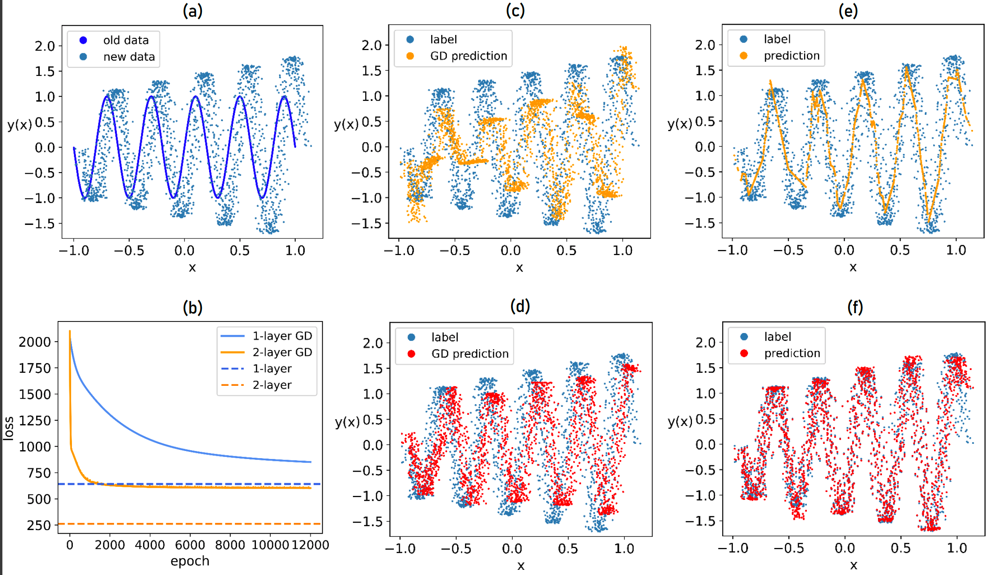
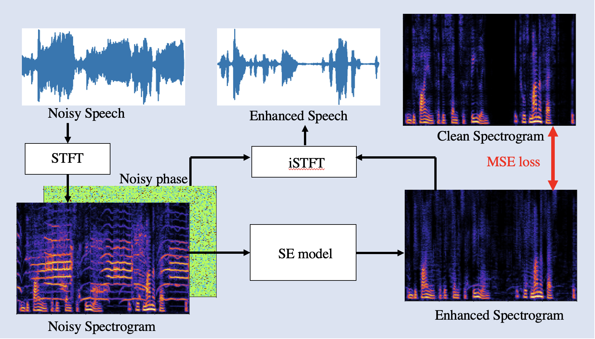
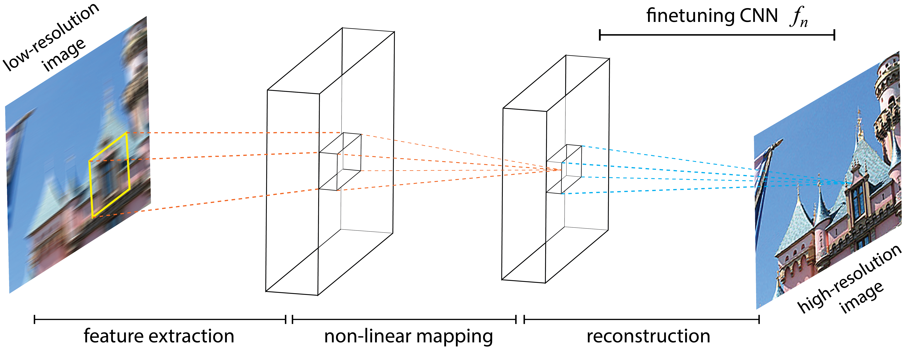

# Layer Variation Analysis for Transfer Learning

We introduce a novel finetuning method **Layer Variation Analysis** (LVA) for transfer learning. Three domain adaptation experiments are demonstrated as follows:

## Experiments
- [Exp. 1] Time Series Regression

- [Exp. 2] Speech Enhancement (denoise)

- [Exp. 3] Super Resolution (image deblur)

## Datasets & Preprocessing
- [Exp. 1] Requires no dataset
- [Exp. 2] Download [DNS-Challenge](https://github.com/microsoft/DNS-Challenge) (or [here](https://drive.google.com/drive/folders/1WHUyRFuh0KnzDJe0aR6WCFTt-2eb5elM?usp=sharing)) and use `/Exp2/data_preprocessing/` for preprocessing.
- [Exp. 3] Download [CUFED](https://acsweb.ucsd.edu/~yuw176/event-curation.html) (or [here](https://drive.google.com/drive/folders/1WHUyRFuh0KnzDJe0aR6WCFTt-2eb5elM?usp=sharing)) and use `/Exp3/preprocessing_SR_images/` for preprocessing.

## Pretrain on source domain
- [Exp. 1] `pretraining.py`
- [Exp. 2] `SE_pretraining.py`
- [Exp. 3] `SRCNN_pretraining.py`

## Transfer Learning to target domain & Compare finetune models
- [Exp. 1] `GD_finetune_1layer.py` & `GD_vs_LVA_1layer.py`
- [Exp. 2] `SE_finetuning_and_comparison.py`
- [Exp. 3] `SRCNN_GD_finetuning.py` & `SRCNN_LVA_comparisons.py`

## Prerequisites
- [Python 3.8](https://www.python.org/)
- [PyTorch 2.0.1](https://pytorch.org/)
- [librosa 0.10.0](https://librosa.org/doc/latest/index.html)
- [pypesq 1.2.4](https://pypi.org/project/pypesq/)
- [pystoi 0.3.3](https://pypi.org/project/pystoi/)
- [Tensorboard 2.13.0](https://pypi.org/project/tensorboard/)
- [scikit-learn 1.2.2](https://pypi.org/project/scikit-learn/)
- [tqdm 4.65.0](https://pypi.org/project/tqdm/)
- [scipy 1.10.1](https://pypi.org/project/scipy/)

## Hardware
- NVIDIA GPU with CUDA 11.0+
